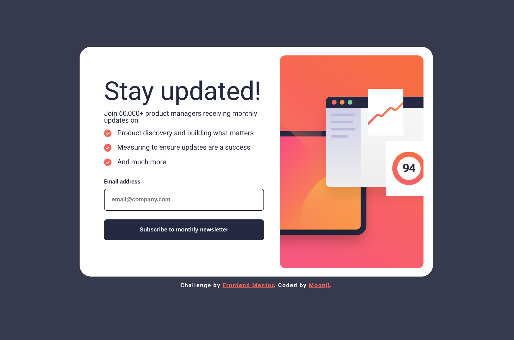
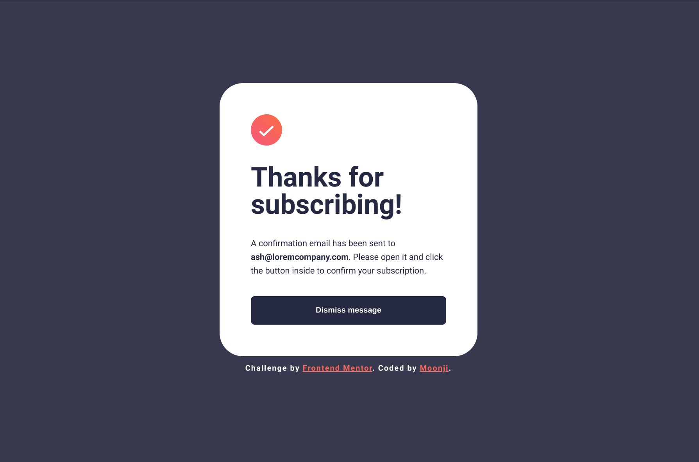
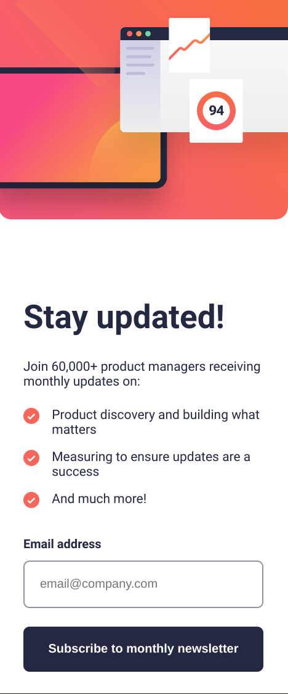
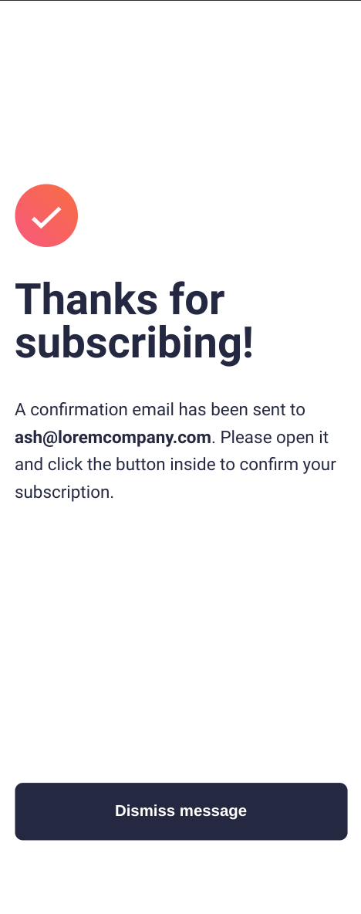

# Frontend Mentor - Newsletter sign-up form with success message solution

This is a solution to the [Newsletter sign-up form with success message challenge on Frontend Mentor](https://www.frontendmentor.io/challenges/newsletter-signup-form-with-success-message-3FC1AZbNrv). Frontend Mentor challenges help you improve your coding skills by building realistic projects. 

## Table of contents

- [Overview](#overview)
  - [The challenge](#the-challenge)
  - [Screenshot](#screenshot)
  - [Links](#links)
- [My process](#my-process)
  - [Built with](#built-with)
  - [What I learned](#what-i-learned)
  - [Continued development](#continued-development)
  - [Useful resources](#useful-resources)
- [Author](#author)

## Overview

### The challenge

Users should be able to:

- Add their email and submit the form
- See a success message with their email after successfully submitting the form
- See form validation messages if:
  - The field is left empty
  - The email address is not formatted correctly
- View the optimal layout for the interface depending on their device's screen size
- See hover and focus states for all interactive elements on the page

### Screenshot

Frontend Mentor's Desktop Design: 


Frontend Mentor's Success Message: 


My Desktop Solution:



My Success Message:



Frontend Mentor's Mobile Design:


Frontend Mentor's Mobile Success Design: 


My Mobile Solution: 



My Mobile Success Message: 




### Links

- Solution URL: [My Github](https://github.com/moonji-spoonji/Newsletter-Sign-up-with-Success-Message)
- Live Site URL: [Newsletter Sign-up on Netlify](https://newsletter-sign-up-moonji.netlify.app/)

## My process

### Built with

- Semantic HTML5 markup
- CSS custom properties
- JavaScript
- Flexbox

### What I learned

#### HTML 
To make the Thank You card appear, we must first make it hidden so it will be assigned the "hidden" class so that it can be toggled by the JS when the form is submitted.
```html
<section class="success-card hidden" id="thanks"> </section>
```

#### CSS
The "hidden" class must be placed at the bottom portion of the CSS document since it will be toggled by two different sections.
```css
/* must be last one listed/specified */
.hidden {
    display: none;
}
```

#### JS
```js
function handleSubmit(e) {
    e.preventDefault();

    const formData = new FormData(e.target);
    const data = Object.fromEntries(formData);
    
    // when the form is submitted, it is replaced by the Thanks for subscribing card 
    thanks.classList.toggle('hidden');
    updateCard.classList.toggle('hidden');
}

form.addEventListener('submit', handleSubmit);

// when dismiss message button is clicked, we are redirected to the original form
dismiss.addEventListener('click', function() {
    thanks.classList.toggle('hidden');    
    updateCard.classList.toggle('hidden');
});
```

### Continued development

I'm not very comfortable with all of JS yet, the form handler stuff doesn't 100% make sense to me tbh, but I would like to understand that and be able to apply the logic to future projects.

### Useful resources

- [Frontend Mentor: Managing Forms](https://www.frontendmentor.io/learning-paths/javascript-fundamentals-oR7g6-mTZ-/steps/66f70aee5832c087f295b057/article/read) - This is the previous lesson that teaches how to manage forms, like with preventDefault().

## Author

- Frontend Mentor - [@moonji-spoonji](https://www.frontendmentor.io/profile/moonji-spoonji)

